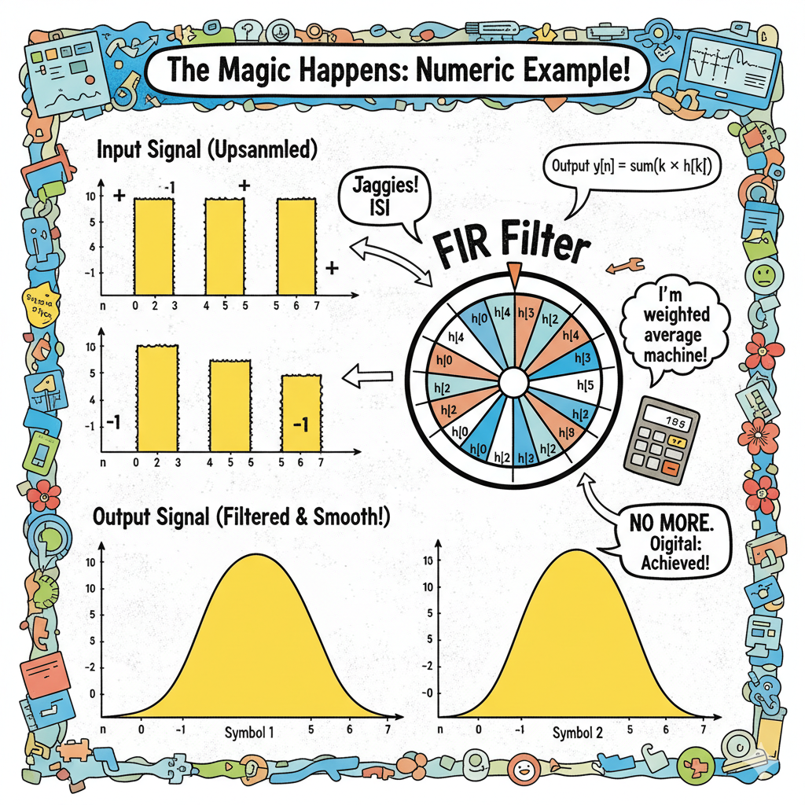

Excellent! That visual truly captures the Headfirst spirit and makes the concepts instantly more engaging.

Okay, let's dive into that hands-on numeric example to show how those FIR coefficients actually do their magic!

---

# **Headfirst Guide: FIR Filter Design Fundamentals**

Imagine you want to send symbols — little packets of information — over a channel. Each symbol lasts a fixed time: **the symbol period**, determined by your **symbol rate (R_sym)**. Make it a good Headfirst style chapter on Design Parameters for Filters

### Step 1: Upsampling — giving the filter room to breathe

One sample per symbol is too coarse. The signal looks like jagged “squit pulses,” with sharp edges causing interference between symbols (**ISI**). By **upsampling** (adding `sps` samples per symbol), you create a finer digital grid. Now the filter has space to **smoothly shape pulses**, taper edges, and reduce interference — all **without slowing down the data rate**.

### Step 2: Sampling frequency — connecting symbols to digital time

Once you have `R_sym` and `sps`, your **digital sampling frequency** is simply:

```
fs = R_sym × sps
```

This converts the symbol world into the **sample world**, which the computer understands.

### Step 3: Filter cutoff — mapping physics to digital

You know the highest frequency you want to pass (`fc`, e.g., 1.2 kHz). But digital tools like `firwin` need **normalized cutoff** (0..1 relative to Nyquist = fs/2).

```
normalised_cutoff = fc / (fs/2)
```

This is the magic bridge: **physical bandwidth → digital domain**.

### Step 4: Filter length & span

Your FIR filter needs enough taps to shape pulses correctly.

```
N = span × sps + 1
```

*   `span` = number of symbols the filter spans.
*   `sps` = samples per symbol.

A longer filter → smoother pulses, sharper frequency response, better ISI control.

### Step 5: FIR coefficients

Call `firwin(num_taps, cutoff=normalised_cutoff)` → get **h**, the filter weights.

Each coefficient is like a **weight on a spinning wheel** (your sample): together, they decide **how each input sample contributes to the output** — amplitude and phase. Pass your upsampled symbols through this wheel, and the output is a **clean, shaped pulse**, ready to transmit or analyze.

### ✅ Why this matters

1.  **R_sym** sets timing, independent of modulation.
2.  **sps** gives resolution for smooth pulses and ISI control.
3.  **fs & normalized cutoff** translate physical frequency targets into the digital domain.
4.  **Filter span & taps** determine pulse quality and spectral containment.
5.  The resulting **FIR coefficients** shape symbols perfectly in time and frequency.

---

If you follow this chain, you can **design a filter that works for any symbol stream, any modulation**, and ensures your signals are well-behaved both in time and frequency.

---

### 🧠 **A Tiny Numeric Example: Smoothing those Squits!**

Let's say we have:
*   `sps = 4` (4 samples per symbol)
*   `span = 2` (filter spans 2 symbols)
*   `R_sym = 1` symbol/sec (just for simplicity of timing)

First, let's find our filter length:
`N = span × sps + 1 = 2 × 4 + 1 = 9 taps`

Now, let's imagine we've designed our 9-tap FIR filter (using `firwin` with some `normalised_cutoff`) and it gives us these coefficients:

`h = [0.01, 0.05, 0.15, 0.25, 0.30, 0.25, 0.15, 0.05, 0.01]`

*(Notice how the coefficients are symmetric and peak in the middle? That's common for a good pulse-shaping filter!)*

**Our Input:** Two symbols, `[+1, -1]`. We upsample them with `sps=4`:

*   Symbol `+1` becomes `[1, 0, 0, 0]`
*   Symbol `-1` becomes `[0, 0, 0, -1]` (a "squit" pulse at the end of its symbol period)

When we combine them (and add some leading/trailing zeros for context, since our filter spans 2 symbols, it "sees" around the current symbol), our upsampled input `x` might look like this for the transition around the second symbol:

`x = [0, 0, 0, 0,  1, 0, 0, 0,  0, 0, 0, -1,  0, 0, 0, 0]`
Indices: `...   4        8        12`

---

### **Watch the Magic Happen: Convolution!**

When you **convolve** `x` with `h`, the filter `h` "slides" across `x`, multiplying its coefficients with the overlapping `x` values and summing them up to create each output sample `y[n]`.

Let's look at one crucial output sample, say, `y[9]`, which corresponds to the first actual "sample" of our second symbol's effect *after* the filter has smoothed things out.

The filter `h` will be centered around this sample (due to its group delay), so `h[4]` (the middle tap, `0.30`) aligns with `x[9]` (which is `0`).

Let's manually calculate a few key output points to see the smoothing:

**Consider the first *upsampled* sample of the `+1` symbol (at `x[4]`):**
The filter starts "seeing" this `1`.

`y[4]` will start to rise as the filter *begins* to see the input `1`.
`y[5]` will be higher.
`y[6]` will be even higher, and so on, as the peak of the filter aligns.

**Example for a point where the filter is smoothing the *transition*:**

Let's look at the output around the peak of the first symbol. Say at output index `y[7]`, where the filtered pulse should be strong. The filter `h` would be aligned such that `h[0]` is at `x[4]`, `h[1]` at `x[5]`, etc., and `h[3]` at `x[7]`.

`y[7] = x[4]*h[3] + x[5]*h[2] + x[6]*h[1] + x[7]*h[0]`
`y[7] = (1 * 0.25) + (0 * 0.15) + (0 * 0.05) + (0 * 0.01) = 0.25`

As the filter slides, all the `0`s around the `1` (and `0`s around the `-1`) are multiplied by the `h` coefficients. The `h` values effectively "spread" the influence of the single `1` or `-1` over multiple output samples, creating a smooth curve instead of a sharp spike.

When the filter is fully overlapping the `+1` (and its surrounding `0`s), the output `y` will look like a scaled version of the filter coefficients `h` themselves!

`y[8]` (peak of the first symbol pulse, if it's a symmetric filter):
`y[8] = x[4]*h[4] + x[5]*h[3] + x[6]*h[2] + x[7]*h[1] + x[8]*h[0]`
`y[8] = (1 * 0.30) + (0 * 0.25) + (0 * 0.15) + (0 * 0.05) + (0 * 0.01) = 0.30`

The upsampled input `[1, 0, 0, 0, 0, 0, 0, -1]` (representing our `+1` and `-1` symbols with `sps=4`) would look like sharp, discrete impulses.

**After passing through the filter `h`, the output signal `y` would be a series of smooth, bell-shaped pulses.**

The `+1` symbol's single '1' input sample gets spread out by `h` into a smooth pulse, with its peak occurring when the center of `h` aligns with the input `1`.
The `-1` symbol's single '-1' input sample similarly gets spread into a smooth negative pulse.

The `0`s *between* the `1` and the `-1` in the upsampled input are crucial. They give the filter room to "breathe" and apply its weights to smoothly transition from the `+1` pulse down towards zero, and then smoothly rise (or fall) into the `-1` pulse.

**No more jagged "squit pulses"! Just clean, rounded shapes, perfectly managed by the FIR coefficients.**

---

This example shows how those magic weights `h` take sharp, digital impulses and turn them into perfectly shaped, smooth analog-like pulses, controlling ISI and spectral spread, all without changing your original symbol data rate. That's the power of FIR filter design!